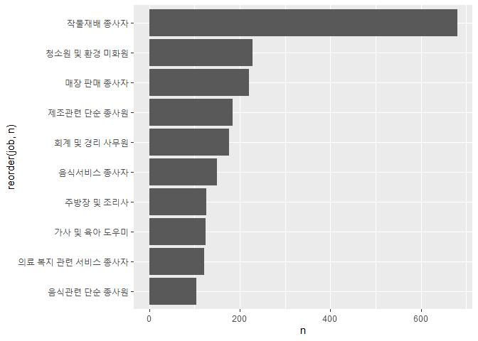
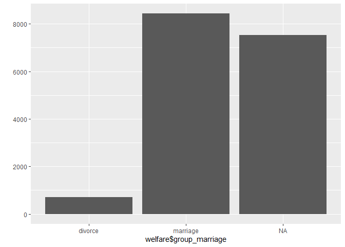

Habits
================
John Doe
March 22, 2005

<!-- RMD 설정 -->

# 09\. 데이터 분석 프로젝트

## ‘한국인의 삶을 파악하라\!’


##### NP

## 09-1. ‘한국복지패널데이터’ 분석 준비하기
데이터 분석을 준비한다. 데이터 분석을 준비한다.데이터 분석을 준비한다.데이터 분석을 준비한다.데이터 분석을 준비한다.데이터 분석을 준비한다.데이터 분석을 준비한다.데이터 분석을 준비한다.데이터 분석을 준비한다.데이터 분석을 준비한다.데이터 분석을 준비한다.데이터 분석을 준비한다.데이터 분석을 준비한다.데이터 분석을 준비한다.데이터 분석을 준비한다.데이터 분석을 준비한다.데이터 분석을 준비한다.데이터 분석을 준비한다.데이터 분석을 준비한다.데이터 분석을 준비한다.데이터 분석을 준비한다.데이터 분석을 준비한다.데이터 분석을 준비한다.데이터 분석을 준비한다.데이터 분석을 준비한다.데이터 분석을 준비한다.데이터 분석을 준비한다.데이터 분석을 준비한다.데이터 분석을 준비한다.데이터 분석을 준비한다.데이터 분석을 준비한다.

- 가구
-가구2
  -  가구3
-    가구 4


#### 한국복지패널데이터

  - 한국보건사회연구원 발간
  - 가구의 경제활동을 연구해 정책 지원에 반영할 목적
  - 2006\~2015년까지 전국에서 7000여 가구를 선정해 매년 추적 조사
  - 경제활동, 생활실태, 복지욕구 등 수천 개 변수에 대한 정보로 구성

##### NP

### 데이터 분석 준비하기

#### 패키지 준비하기

``` r
install.packages("foreign")  # foreign 패키지 설치
library(foreign)             # SPSS 파일 로드
library(dplyr)               # 전처리
library(ggplot2)             # 시각화
library(readxl)              # 엑셀 파일 불러오기
```

#### 데이터 준비하기

``` r
# 데이터 불러오기
raw_welfare <- read.spss(file = "Koweps_hpc10_2015_beta1.sav",
                         to.data.frame = T)

# 복사본 만들기
welfare <- raw_welfare
```

##### NP

#### 데이터 검토하기

``` r
head(welfare)
tail(welfare)
View(welfare)
dim(welfare)
str(welfare)
summary(welfare)
```

  - 대규모 데이터는 변수가 많고 변수명이 코드로 되어 있어서 전체 데이터 구조를 한눈에 파악하기 어려움

  - 변수명을 쉬운 단어로 바꾼 후 분석에 사용할 변수들 각각 파악해야 함

##### NP

#### 변수명 바꾸기

``` r
welfare <- rename(welfare,
                  sex = h10_g3,            # 성별
                  birth = h10_g4,          # 태어난 연도
                  marriage = h10_g10,      # 혼인 상태
                  religion = h10_g11,      # 종교
                  income = p1002_8aq1,     # 월급
                  code_job = h10_eco9,     # 직종 코드
                  code_region = h10_reg7)  # 지역 코드
```

##### NP

#### 데이터 분석 절차

  - 1단계. 변수 검토 및 전처리
  - 2단계. 변수 간 관계 분석


##### NP

## 09-2. 성별에 따른 월급 차이

## \- “성별에 따라 월급이 다를까?”

#### 분석 절차

**1. 변수 검토 및 전처리**

  - 성별
  - 월급

**2. 변수 간 관계 분석**

  - 성별 월급 평균표 만들기
  - 그래프 만들기

##### NP

### 성별 변수 검토 및 전처리

#### 1\. 변수 검토하기

``` r
class(welfare$sex)
```

    ## [1] "numeric"

``` r
table(welfare$sex)
```

    ## 
    ##    1    2 
    ## 7578 9086

##### NP

#### 2\. 전처리

``` r
# 이상치 확인
table(welfare$sex)
```

    ## 
    ##    1    2 
    ## 7578 9086

``` r
# 이상치 결측 처리
welfare$sex <- ifelse(welfare$sex == 9, NA, welfare$sex)

# 결측치 확인
table(is.na(welfare$sex))
```

    ## 
    ## FALSE 
    ## 16664

``` r
# 성별 항목 이름 부여
welfare$sex <- ifelse(welfare$sex == 1, "male", "female")
table(welfare$sex)
```

    ## 
    ## female   male 
    ##   9086   7578

``` r
qplot(welfare$sex)
```

<!-- -->

##### NP

### 월급 변수 검토 및 전처리

#### 1\. 변수 검토하기

``` r
class(welfare$income)
```

    ## [1] "numeric"

``` r
summary(welfare$income)
```

    ##    Min. 1st Qu.  Median    Mean 3rd Qu.    Max.    NA's 
    ##     0.0   122.0   192.5   241.6   316.6  2400.0   12030

##### NP

``` r
qplot(welfare$income)
```

<!-- -->

##### NP

``` r
qplot(welfare$income) + xlim(0, 1000)
```

<!-- -->

##### NP

#### 2\. 전처리

``` r
# 이상치 확인
summary(welfare$income)
```

    ##    Min. 1st Qu.  Median    Mean 3rd Qu.    Max.    NA's 
    ##     0.0   122.0   192.5   241.6   316.6  2400.0   12030

``` r
# 이상치 결측 처리
welfare$income <- ifelse(welfare$income %in% c(0, 9999), NA, welfare$income)

# 결측치 확인
table(is.na(welfare$income))
```

    ## 
    ## FALSE  TRUE 
    ##  4620 12044

##### NP

### 성별에 따른 월급 차이 분석하기

#### 1\. 성별 월급 평균표 만들기

``` r
sex_income <- welfare %>%
  filter(!is.na(income)) %>%
  group_by(sex) %>%
  summarise(mean_income = mean(income))
```

    ## `summarise()` ungrouping output (override with `.groups` argument)

``` r
sex_income
```

    ## # A tibble: 2 x 2
    ##   sex    mean_income
    ##   <chr>        <dbl>
    ## 1 female        163.
    ## 2 male          312.

##### NP

#### 2\. 그래프 만들기

``` r
ggplot(data = sex_income, aes(x = sex, y = mean_income)) + geom_col()
```

<!-- -->

##### NP

## 09-3. 나이와 월급의 관계

## \- “몇 살 때 월급을 가장 많이 받을까?”

#### 분석 절차

**1. 변수 검토 및 전처리**

  - 나이
  - 월급

**2. 변수 간 관계 분석**

  - 나이에 따른 월급 평균표 만들기
  - 그래프 만들기

##### NP

#### 1\. 변수 검토하기

``` r
class(welfare$birth)
```

    ## [1] "numeric"

``` r
summary(welfare$birth)
```

    ##    Min. 1st Qu.  Median    Mean 3rd Qu.    Max. 
    ##    1907    1946    1966    1968    1988    2014

``` r
qplot(welfare$birth)
```

<!-- -->

#### 2\. 전처리

``` r
# 이상치 확인
summary(welfare$birth)
```

    ##    Min. 1st Qu.  Median    Mean 3rd Qu.    Max. 
    ##    1907    1946    1966    1968    1988    2014

``` r
# 결측치 확인
table(is.na(welfare$birth))
```

    ## 
    ## FALSE 
    ## 16664

``` r
# 이상치 결측 처리
welfare$birth <- ifelse(welfare$birth == 9999, NA, welfare$birth)
table(is.na(welfare$birth))
```

    ## 
    ## FALSE 
    ## 16664

##### NP

#### 3\. 파생변수 만들기 - 나이

``` r
welfare$age <- 2015 - welfare$birth + 1
summary(welfare$age)
```

    ##    Min. 1st Qu.  Median    Mean 3rd Qu.    Max. 
    ##    2.00   28.00   50.00   48.43   70.00  109.00

``` r
qplot(welfare$age)
```

<!-- -->

##### NP

### 나이와 월급의 관계 분석하기

#### 1\. 나이에 따른 월급 평균표 만들기

``` r
age_income <- welfare %>%
  filter(!is.na(income)) %>%
  group_by(age) %>%
  summarise(mean_income = mean(income))
```

    ## `summarise()` ungrouping output (override with `.groups` argument)

``` r
head(age_income)
```

    ## # A tibble: 6 x 2
    ##     age mean_income
    ##   <dbl>       <dbl>
    ## 1    20        121.
    ## 2    21        106.
    ## 3    22        130.
    ## 4    23        142.
    ## 5    24        134.
    ## 6    25        145.

##### NP

#### 2\. 그래프 만들기

``` r
ggplot(data = age_income, aes(x = age, y = mean_income)) + geom_line()
```

<!-- -->

##### NP

## 09-4. 연령대에 따른 월급 차이

## \- “어떤 연령대의 월급이 가장 많을까?”

#### 분석 절차

**1. 변수 검토 및 전처리**

  - 연령대
  - 월급

**2. 변수 간 관계 분석**

  - 연령대별 월급 평균표 만들기
  - 그래프 만들기

##### NP

### 연령대 변수 검토 및 전처리하기

#### 파생변수 만들기 - 연령대

``` r
welfare <- welfare %>%
  mutate(ageg = ifelse(age < 30, "young",
                       ifelse(age <= 59, "middle", "old")))

table(welfare$ageg)
```

    ## 
    ## middle    old  young 
    ##   6049   6281   4334

##### NP

``` r
qplot(welfare$ageg)
```

<!-- -->

##### NP

### 연령대에 따른 월급 차이 분석하기

#### 1\. 연령대별 월급 평균표 만들기

``` r
ageg_income <- welfare %>%
  filter(!is.na(income)) %>%
  group_by(ageg) %>%
  summarise(mean_income = mean(income))
```

    ## `summarise()` ungrouping output (override with `.groups` argument)

``` r
ageg_income
```

    ## # A tibble: 3 x 2
    ##   ageg   mean_income
    ##   <chr>        <dbl>
    ## 1 middle        282.
    ## 2 old           125.
    ## 3 young         164.

##### NP

#### 2\. 그래프 만들기

``` r
ggplot(data = ageg_income, aes(x = ageg, y = mean_income)) + geom_col()
```

<!-- -->

##### NP

#### 막대 정렬 : 초년, 중년, 노년 나이 순

``` r
ggplot(data = ageg_income, aes(x = ageg, y = mean_income)) +
  geom_col() +
  scale_x_discrete(limits = c("young", "middle", "old"))
```

<!-- -->

## 09-5. 연령대 및 성별 월급 차이

## \- “성별 월급 차이는 연령대별로 다를까?”

#### 분석 절차

**1. 변수 검토 및 전처리**

  - 연령대
  - 성별
  - 월급

**2. 변수 간 관계 분석**

  - 연령대 및 성별 월급 평균표 만들기
  - 그래프 만들기

##### NP

### 연령대 및 성별 월급 차이 분석하기

#### 1\. 연령대 및 성별 월급 평균표 만들기

``` r
sex_income <- welfare %>%
  filter(!is.na(income)) %>%
  group_by(ageg, sex) %>%
  summarise(mean_income = mean(income))
```

    ## `summarise()` regrouping output by 'ageg' (override with `.groups` argument)

``` r
sex_income
```

    ## # A tibble: 6 x 3
    ## # Groups:   ageg [3]
    ##   ageg   sex    mean_income
    ##   <chr>  <chr>        <dbl>
    ## 1 middle female       188. 
    ## 2 middle male         353. 
    ## 3 old    female        81.5
    ## 4 old    male         174. 
    ## 5 young  female       160. 
    ## 6 young  male         171.

##### NP

#### 2\. 그래프 만들기

``` r
ggplot(data = sex_income, aes(x = ageg, y = mean_income, fill = sex)) +
  geom_col() +
  scale_x_discrete(limits = c("young", "middle", "old"))
```

<!-- -->

##### NP

#### 성별 막대 분리

``` r
ggplot(data = sex_income, aes(x = ageg, y = mean_income, fill = sex)) +
  geom_col(position = "dodge") +
  scale_x_discrete(limits = c("young", "middle", "old"))
```

<!-- -->

##### NP

### 나이 및 성별 월급 차이 분석하기

``` r
# 성별 연령별 월급 평균표 만들기
sex_age <- welfare %>%
  filter(!is.na(income)) %>%
  group_by(age, sex) %>%
  summarise(mean_income = mean(income))
```

    ## `summarise()` regrouping output by 'age' (override with `.groups` argument)

``` r
head(sex_age)
```

    ## # A tibble: 6 x 3
    ## # Groups:   age [3]
    ##     age sex    mean_income
    ##   <dbl> <chr>        <dbl>
    ## 1    20 female        147.
    ## 2    20 male           69 
    ## 3    21 female        107.
    ## 4    21 male          102.
    ## 5    22 female        140.
    ## 6    22 male          118.

##### NP

#### 2\. 그래프 만들기

``` r
ggplot(data = sex_age, aes(x = age, y = mean_income, col = sex)) + geom_line()
```

<!-- -->

##### NP

## 09-6. 직업별 월급 차이

## \- “어떤 직업이 월급을 가장 많이 받을까?”

#### 분석 절차

**1. 변수 검토 및 전처리**

  - 직업
  - 월급

**2. 변수 간 관계 분석**

  - 직업별 월급 평균표 만들기
  - 그래프 만들기

##### NP

#### 1\. 변수 검토하기

``` r
class(welfare$code_job)
```

    ## [1] "numeric"

``` r
table(welfare$code_job)
```

    ## 
    ##  111  120  131  132  133  134  135  139  141  149  151  152  153  159  211  212 
    ##    2   16   10   11    9    3    7   10   35   20   26   18   15   16    8    4 
    ##  213  221  222  223  224  231  232  233  234  235  236  237  239  241  242  243 
    ##    3   17   31   12    4   41    5    3    6   48   14    2   29   12    4   63 
    ##  244  245  246  247  248  251  252  253  254  259  261  271  272  273  274  281 
    ##    4   33   59   77   38   14  111   24   67  109    4   15   11    4   36   17 
    ##  283  284  285  286  289  311  312  313  314  320  330  391  392  399  411  412 
    ##    8   10   26   16    5  140  260  220   84   75   15    4   13   87   47   12 
    ##  421  422  423  429  431  432  441  442  510  521  522  530  611  612  613  620 
    ##  124   71    5   14   20   33  154  197  192  353    5  106 1320   11   40    2 
    ##  630  710  721  722  730  741  742  743  751  752  753  761  762  771  772  773 
    ##   20   29   30   22   16   27    3   34   34    5   49   69   27   11   61   86 
    ##  774  780  791  792  799  811  812  819  821  822  823  831  832  841  842  843 
    ##    7   17    5   21   45   16    1    6    9    9   23    5   17   32   10    4 
    ##  851  852  853  854  855  861  862  863  864  871  873  874  875  876  881  882 
    ##   19   13    7   33    9    3   14   17   31    2  257   34   37    2    2    3 
    ##  891  892  899  910  921  922  930  941  942  951  952  953  991  992  999 1011 
    ##    8   19   16  102   31   74  289  325   99  125  122   73   45   12  141    2 
    ## 1012 
    ##   17

##### NP

#### 2\. 전처리

**직업분류코드 목록 불러오기**

``` r
library(readxl)
list_job <- read_excel("Koweps_Codebook.xlsx", col_names = T, sheet = 2)
head(list_job)
```

    ## # A tibble: 6 x 2
    ##   code_job job                                
    ##      <dbl> <chr>                              
    ## 1      111 의회의원 고위공무원 및 공공단체임원
    ## 2      112 기업고위임원                       
    ## 3      120 행정 및 경영지원 관리자            
    ## 4      131 연구 교육 및 법률 관련 관리자      
    ## 5      132 보험 및 금융 관리자                
    ## 6      133 보건 및 사회복지 관련 관리자

``` r
dim(list_job)
```

    ## [1] 149   2

##### NP

**`welfare`에 직업명 결합**

``` r
welfare <- left_join(welfare, list_job, id = "code_job")
```

    ## Joining, by = "code_job"

``` r
welfare %>%
  filter(!is.na(code_job)) %>%
  select(code_job, job) %>%
  head(10)
```

    ##    code_job                                job
    ## 1       942                   경비원 및 검표원
    ## 2       762                             전기공
    ## 3       530 방문 노점 및 통신 판매 관련 종사자
    ## 4       999        기타 서비스관련 단순 종사원
    ## 5       312                    경영관련 사무원
    ## 6       254             문리 기술 및 예능 강사
    ## 7       510                        영업 종사자
    ## 8       530 방문 노점 및 통신 판매 관련 종사자
    ## 9       286   스포츠 및 레크레이션 관련 전문가
    ## 10      521                   매장 판매 종사자

##### NP

### 직업별 월급 차이 분석하기

#### 1\. 직업별 월급 평균표 만들기

``` r
job_income <- welfare %>%
  filter(!is.na(job) & !is.na(income)) %>%
  group_by(job) %>%
  summarise(mean_income = mean(income))
```

    ## `summarise()` ungrouping output (override with `.groups` argument)

``` r
head(job_income)
```

    ## # A tibble: 6 x 2
    ##   job                           mean_income
    ##   <chr>                               <dbl>
    ## 1 가사 및 육아 도우미                  80.2
    ## 2 간호사                              241. 
    ## 3 건설 및 광업 단순 종사원            190. 
    ## 4 건설 및 채굴 기계운전원             358. 
    ## 5 건설 전기 및 생산 관련 관리자       536. 
    ## 6 건설관련 기능 종사자                247.

##### NP

#### 2\. 상위 10개 추출

``` r
top10 <- job_income %>%
  arrange(desc(mean_income)) %>%
  head(10)

top10
```

    ## # A tibble: 10 x 2
    ##    job                                  mean_income
    ##    <chr>                                      <dbl>
    ##  1 금속 재료 공학 기술자 및 시험원             845.
    ##  2 의료진료 전문가                             844.
    ##  3 의회의원 고위공무원 및 공공단체임원         750 
    ##  4 보험 및 금융 관리자                         726.
    ##  5 제관원 및 판금원                            572.
    ##  6 행정 및 경영지원 관리자                     564.
    ##  7 문화 예술 디자인 및 영상 관련 관리자        557.
    ##  8 연구 교육 및 법률 관련 관리자               550.
    ##  9 건설 전기 및 생산 관련 관리자               536.
    ## 10 석유 및 화학물 가공장치 조작원              532.

##### NP

#### 3\. 그래프 만들기

``` r
ggplot(data = top10, aes(x = reorder(job, mean_income), y = mean_income)) +
  geom_col() +
  coord_flip()
```

<!-- -->

##### NP

#### 4\. 하위 10위 추출

``` r
bottom10 <- job_income %>%
  arrange(mean_income) %>%
  head(10)

bottom10
```

    ## # A tibble: 10 x 2
    ##    job                          mean_income
    ##    <chr>                              <dbl>
    ##  1 가사 및 육아 도우미                 80.2
    ##  2 임업관련 종사자                     83.3
    ##  3 기타 서비스관련 단순 종사원         88.2
    ##  4 청소원 및 환경 미화원               88.8
    ##  5 약사 및 한약사                      89  
    ##  6 작물재배 종사자                     92  
    ##  7 농립어업관련 단순 종사원           102. 
    ##  8 의료 복지 관련 서비스 종사자       104. 
    ##  9 음식관련 단순 종사원               108. 
    ## 10 판매관련 단순 종사원               117.

##### NP

#### 5\. 그래프 만들기

``` r
ggplot(data = bottom10, aes(x = reorder(job, -mean_income),
                            y = mean_income)) +
  geom_col() +
  coord_flip() +
  ylim(0, 850)
```

<!-- -->

##### NP

## 09-7. 성별 직업 빈도

## \- “성별로 어떤 직업이 가장 많을까?”

#### 분석 절차

**1. 변수 검토 및 전처리**

  - 성별
  - 직업

**2. 변수 간 관계 분석**

  - 성별 직업 빈도표 만들기
  - 그래프 만들기

##### NP

### 성별 직업 빈도 분석하기

#### 1\. 성별 직업 빈도표 만들기

``` r
# 남성 직업 빈도 상위 10개 추출
job_male <- welfare %>%
  filter(!is.na(job) & sex == "male") %>%
  group_by(job) %>%
  summarise(n = n()) %>%
  arrange(desc(n)) %>%
  head(10)
```

    ## `summarise()` ungrouping output (override with `.groups` argument)

``` r
job_male
```

    ## # A tibble: 10 x 2
    ##    job                          n
    ##    <chr>                    <int>
    ##  1 작물재배 종사자            640
    ##  2 자동차 운전원              251
    ##  3 경영관련 사무원            213
    ##  4 영업 종사자                141
    ##  5 매장 판매 종사자           132
    ##  6 제조관련 단순 종사원       104
    ##  7 청소원 및 환경 미화원       97
    ##  8 건설 및 광업 단순 종사원    95
    ##  9 경비원 및 검표원            95
    ## 10 행정 사무원                 92

##### NP

``` r
# 여성 직업 빈도 상위 10개 추출
job_female <- welfare %>%
  filter(!is.na(job) & sex == "female") %>%
  group_by(job) %>%
  summarise(n = n()) %>%
  arrange(desc(n)) %>%
  head(10)
```

    ## `summarise()` ungrouping output (override with `.groups` argument)

``` r
job_female
```

    ## # A tibble: 10 x 2
    ##    job                              n
    ##    <chr>                        <int>
    ##  1 작물재배 종사자                680
    ##  2 청소원 및 환경 미화원          228
    ##  3 매장 판매 종사자               221
    ##  4 제조관련 단순 종사원           185
    ##  5 회계 및 경리 사무원            176
    ##  6 음식서비스 종사자              149
    ##  7 주방장 및 조리사               126
    ##  8 가사 및 육아 도우미            125
    ##  9 의료 복지 관련 서비스 종사자   121
    ## 10 음식관련 단순 종사원           104

##### NP

#### 2\. 그래프 만들기

``` r
# 남성 직업 빈도 상위 10개 직업
ggplot(data = job_male, aes(x = reorder(job, n), y = n)) +
  geom_col() +
  coord_flip()
```

<!-- -->

##### NP

``` r
# 여성 직업 빈도 상위 10개 직업
ggplot(data = job_female, aes(x = reorder(job, n), y = n)) +
  geom_col() +
  coord_flip()
```

<!-- -->

##### NP

## 09-8. 종교 유무에 따른 이혼율

## \- "종교가 있는 사람들이 이혼을 덜 할까?

#### 분석 절차

**1. 변수 검토 및 전처리**

  - 종교
  - 혼인 상태

**2. 변수 간 관계 분석**

  - 종교 유무에 따른 이혼율 표 만들기
  - 그래프 만들기

##### NP

### 종교 변수 검토 및 전처리하기

#### 1\. 변수 검토하기

``` r
class(welfare$religion)
```

    ## [1] "numeric"

``` r
table(welfare$religion)
```

    ## 
    ##    1    2 
    ## 8047 8617

##### NP

#### 2\. 전처리

``` r
# 종교 유무 이름 부여
welfare$religion <- ifelse(welfare$religion == 1, "yes", "no")
table(welfare$religion)
```

    ## 
    ##   no  yes 
    ## 8617 8047

``` r
qplot(welfare$religion)
```

<!-- -->

### 혼인 상태 변수 검토 및 전처리하기

#### 1\. 변수 검토하기

``` r
class(welfare$marriage)
```

    ## [1] "numeric"

``` r
table(welfare$marriage)
```

    ## 
    ##    0    1    2    3    4    5    6 
    ## 2861 8431 2117  712   84 2433   26

##### NP

#### 2\. 전처리

``` r
# 이혼 여부 변수 만들기
welfare$group_marriage <- ifelse(welfare$marriage == 1, "marriage",
                          ifelse(welfare$marriage == 3, "divorce", NA))

table(welfare$group_marriage)
```

    ## 
    ##  divorce marriage 
    ##      712     8431

``` r
table(is.na(welfare$group_marriage))
```

    ## 
    ## FALSE  TRUE 
    ##  9143  7521

##### NP

``` r
qplot(welfare$group_marriage)
```

<!-- -->

##### NP

### 종교 유무에 따른 이혼율 분석하기

#### 1\. 종교 유무에 따른 이혼율 표 만들기

``` r
religion_marriage <- welfare %>%
  filter(!is.na(group_marriage)) %>%
  group_by(religion, group_marriage) %>%
  summarise(n = n()) %>%
  mutate(tot_group = sum(n)) %>%
  mutate(pct = round(n/tot_group*100, 1))
```

    ## `summarise()` regrouping output by 'religion' (override with `.groups` argument)

``` r
religion_marriage
```

    ## # A tibble: 4 x 5
    ## # Groups:   religion [2]
    ##   religion group_marriage     n tot_group   pct
    ##   <chr>    <chr>          <int>     <int> <dbl>
    ## 1 no       divorce          384      4602   8.3
    ## 2 no       marriage        4218      4602  91.7
    ## 3 yes      divorce          328      4541   7.2
    ## 4 yes      marriage        4213      4541  92.8

##### NP

#### `count()` 활용

``` r
religion_marriage <- welfare %>%
  filter(!is.na(group_marriage)) %>%
  count(religion, group_marriage) %>%
  group_by(religion) %>%
  mutate(pct = round(n/sum(n)*100, 1))
```

##### NP

#### 2\. 이혼율 표 만들기

``` r
# 이혼 추출
divorce <- religion_marriage %>%
  filter(group_marriage == "divorce") %>%
  select(religion, pct)

divorce
```

    ## # A tibble: 2 x 2
    ## # Groups:   religion [2]
    ##   religion   pct
    ##   <chr>    <dbl>
    ## 1 no         8.3
    ## 2 yes        7.2

##### NP

#### 3\. 그래프 만들기

``` r
ggplot(data = divorce, aes(x = religion, y = pct)) + geom_col()
```

<!-- -->

##### NP

### 연령대 및 종교 유무에 따른 이혼율 분석하기

#### 1\. 연령대별 이혼율 표 만들기

``` r
ageg_marriage <- welfare %>%
  filter(!is.na(group_marriage)) %>%
  group_by(ageg, group_marriage) %>%
  summarise(n = n()) %>%
  mutate(tot_group = sum(n)) %>%
  mutate(pct = round(n/tot_group*100, 1))
```

    ## `summarise()` regrouping output by 'ageg' (override with `.groups` argument)

``` r
ageg_marriage
```

    ## # A tibble: 6 x 5
    ## # Groups:   ageg [3]
    ##   ageg   group_marriage     n tot_group   pct
    ##   <chr>  <chr>          <int>     <int> <dbl>
    ## 1 middle divorce          437      4918   8.9
    ## 2 middle marriage        4481      4918  91.1
    ## 3 old    divorce          273      4165   6.6
    ## 4 old    marriage        3892      4165  93.4
    ## 5 young  divorce            2        60   3.3
    ## 6 young  marriage          58        60  96.7

##### NP

#### `count()` 활용

``` r
ageg_marriage <- welfare %>%
  filter(!is.na(group_marriage)) %>%
  count(ageg, group_marriage) %>%
  group_by(ageg) %>%
  mutate(pct = round(n/sum(n)*100, 1))
```

##### NP

#### 2\. 연령대별 이혼율 그래프 만들기

``` r
# 초년 제외, 이혼 추출
ageg_divorce <- ageg_marriage %>%
  filter(ageg != "young" & group_marriage == "divorce") %>%
  select(ageg, pct)

ageg_divorce
```

    ## # A tibble: 2 x 2
    ## # Groups:   ageg [2]
    ##   ageg     pct
    ##   <chr>  <dbl>
    ## 1 middle   8.9
    ## 2 old      6.6

##### NP

``` r
# 그래프 만들기
ggplot(data = ageg_divorce, aes(x = ageg, y = pct)) + geom_col()
```

<!-- -->

##### NP

#### 3\. 연령대 및 종교 유무에 따른 이혼율 표 만들기

``` r
# 연령대, 종교유무, 결혼상태별 비율표 만들기
ageg_religion_marriage <- welfare %>%
  filter(!is.na(group_marriage) & ageg != "young") %>%
  group_by(ageg, religion, group_marriage) %>%
  summarise(n = n()) %>%
  mutate(tot_group = sum(n)) %>%
  mutate(pct = round(n/tot_group*100, 1))
```

    ## `summarise()` regrouping output by 'ageg', 'religion' (override with `.groups` argument)

``` r
ageg_religion_marriage
```

    ## # A tibble: 8 x 6
    ## # Groups:   ageg, religion [4]
    ##   ageg   religion group_marriage     n tot_group   pct
    ##   <chr>  <chr>    <chr>          <int>     <int> <dbl>
    ## 1 middle no       divorce          260      2681   9.7
    ## 2 middle no       marriage        2421      2681  90.3
    ## 3 middle yes      divorce          177      2237   7.9
    ## 4 middle yes      marriage        2060      2237  92.1
    ## 5 old    no       divorce          123      1884   6.5
    ## 6 old    no       marriage        1761      1884  93.5
    ## 7 old    yes      divorce          150      2281   6.6
    ## 8 old    yes      marriage        2131      2281  93.4

##### NP

#### `count()` 활용

``` r
ageg_religion_marriage <- welfare %>%
  filter(!is.na(group_marriage) & ageg != "young") %>%
  count(ageg, religion, group_marriage) %>%
  group_by(ageg, religion) %>%
  mutate(pct = round(n/sum(n)*100, 1))
```

##### NP

#### 연령대 및 종교 유무별 이혼율 표 만들기

``` r
df_divorce <- ageg_religion_marriage %>%
  filter(group_marriage == "divorce") %>%
  select(ageg, religion, pct)

df_divorce
```

    ## # A tibble: 4 x 3
    ## # Groups:   ageg, religion [4]
    ##   ageg   religion   pct
    ##   <chr>  <chr>    <dbl>
    ## 1 middle no         9.7
    ## 2 middle yes        7.9
    ## 3 old    no         6.5
    ## 4 old    yes        6.6

##### NP

#### 4\. 연령대 및 종교 유무에 따른 이혼율 그래프 만들기

``` r
ggplot(data = df_divorce, aes(x = ageg, y = pct, fill = religion )) +
  geom_col(position = "dodge")
```

<!-- -->

##### NP

## 09-9. 지역별 연령대 비율

## \- “노년층이 많은 지역은 어디일까?”

#### 분석 절차

**1. 변수 검토 및 전처리**

  - 지역
  - 연령대

**2. 변수 간 관계 분석**

  - 지역별 연령대 비율표 만들기
  - 그래프 만들기

##### NP

### 지역 변수 검토 및 전처리하기

#### 1\. 변수 검토하기

``` r
class(welfare$code_region)
```

    ## [1] "numeric"

``` r
table(welfare$code_region)
```

    ## 
    ##    1    2    3    4    5    6    7 
    ## 2486 3711 2785 2036 1467 1257 2922

##### NP

#### 2\. 전처리

``` r
# 지역 코드 목록 만들기
list_region <- data.frame(code_region = c(1:7),
                          region = c("서울",
                                     "수도권(인천/경기)",
                                     "부산/경남/울산",
                                     "대구/경북",
                                     "대전/충남",
                                     "강원/충북",
                                     "광주/전남/전북/제주도"))
list_region
```

    ##   code_region                region
    ## 1           1                  서울
    ## 2           2     수도권(인천/경기)
    ## 3           3        부산/경남/울산
    ## 4           4             대구/경북
    ## 5           5             대전/충남
    ## 6           6             강원/충북
    ## 7           7 광주/전남/전북/제주도

##### NP

#### `welfare`에 지역명 변수 추가

``` r
welfare <- left_join(welfare, list_region, id = "code_region")
```

    ## Joining, by = "code_region"

``` r
welfare %>%
  select(code_region, region) %>%
  head
```

    ##   code_region region
    ## 1           1   서울
    ## 2           1   서울
    ## 3           1   서울
    ## 4           1   서울
    ## 5           1   서울
    ## 6           1   서울

##### NP

### 지역별 연령대 비율 분석하기

#### 1\. 지역별 연령대 비율표 만들기

``` r
region_ageg <- welfare %>%
  group_by(region, ageg) %>%
  summarise(n = n()) %>%
  mutate(tot_group = sum(n)) %>%
  mutate(pct = round(n/tot_group*100, 2))
```

    ## `summarise()` regrouping output by 'region' (override with `.groups` argument)

``` r
head(region_ageg)
```

    ## # A tibble: 6 x 5
    ## # Groups:   region [2]
    ##   region                ageg       n tot_group   pct
    ##   <chr>                 <chr>  <int>     <int> <dbl>
    ## 1 강원/충북             middle   417      1257  33.2
    ## 2 강원/충북             old      555      1257  44.2
    ## 3 강원/충북             young    285      1257  22.7
    ## 4 광주/전남/전북/제주도 middle   947      2922  32.4
    ## 5 광주/전남/전북/제주도 old     1233      2922  42.2
    ## 6 광주/전남/전북/제주도 young    742      2922  25.4

##### NP

#### `count()` 활용

``` r
region_ageg <- welfare %>%
  count(region, ageg) %>%
  group_by(region) %>%
  mutate(pct = round(n/sum(n)*100, 2))
```

##### NP

#### 2\. 그래프 만들기

``` r
ggplot(data = region_ageg, aes(x = region, y = pct, fill = ageg)) +
  geom_col() +
  coord_flip()
```

<!-- -->

##### NP

#### 3\. 막대 정렬하기 : 노년층 비율 높은 순

``` r
# 노년층 비율 내림차순 정렬
list_order_old <- region_ageg %>%
  filter(ageg == "old") %>%
  arrange(pct)

list_order_old
```

    ## # A tibble: 7 x 5
    ## # Groups:   region [7]
    ##   region                ageg      n tot_group   pct
    ##   <chr>                 <chr> <int>     <int> <dbl>
    ## 1 수도권(인천/경기)     old    1109      3711  29.9
    ## 2 서울                  old     805      2486  32.4
    ## 3 대전/충남             old     527      1467  35.9
    ## 4 부산/경남/울산        old    1124      2785  40.4
    ## 5 광주/전남/전북/제주도 old    1233      2922  42.2
    ## 6 강원/충북             old     555      1257  44.2
    ## 7 대구/경북             old     928      2036  45.6

``` r
# 지역명 순서 변수 만들기
order <- list_order_old$region
order
```

    ## [1] "수도권(인천/경기)"     "서울"                  "대전/충남"            
    ## [4] "부산/경남/울산"        "광주/전남/전북/제주도" "강원/충북"            
    ## [7] "대구/경북"

##### NP

``` r
ggplot(data = region_ageg, aes(x = region,  y = pct, fill = ageg)) +
  geom_col() +
  coord_flip() +
  scale_x_discrete(limits = order)
```

<!-- -->

##### NP

#### 4\. 연령대 순으로 막대 색깔 나열하기

``` r
class(region_ageg$ageg)
```

    ## [1] "character"

``` r
levels(region_ageg$ageg)
```

    ## NULL

``` r
region_ageg$ageg <- factor(region_ageg$ageg,
                           level = c("old", "middle", "young"))
class(region_ageg$ageg)
```

    ## [1] "factor"

``` r
levels(region_ageg$ageg)
```

    ## [1] "old"    "middle" "young"

##### NP

``` r
ggplot(data = region_ageg, aes(x = region,  y = pct, fill = ageg)) +
  geom_col() +
  coord_flip() +
  scale_x_discrete(limits = order)
```

<!-- -->
